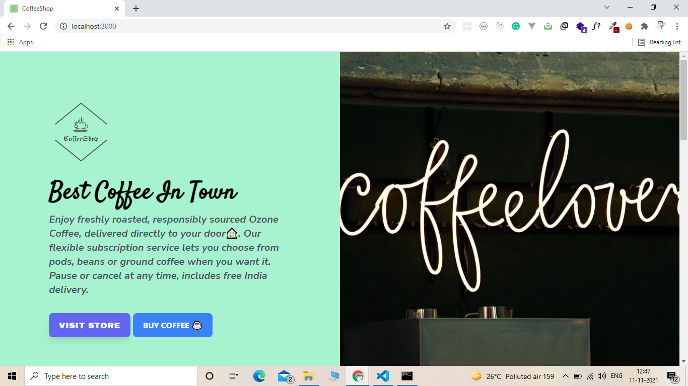

<div id="top"></div>
<!--
*** Thanks for checking out the Best-README-Template. If you have a suggestion
*** that would make this better, please fork the repo and create a pull request
*** or simply open an issue with the tag "enhancement".
*** Don't forget to give the project a star!
*** Thanks again! Now go create something AMAZING! :D
-->

<!-- PROJECT SHIELDS -->
<!--
*** I'm using markdown "reference style" links for readability.
*** Reference links are enclosed in brackets [ ] instead of parentheses ( ).
*** See the bottom of this document for the declaration of the reference variables
*** for contributors-url, forks-url, etc. This is an optional, concise syntax you may use.
*** https://www.markdownguide.org/basic-syntax/#reference-style-links
-->

[![Contributors][contributors-shield]][contributors-url]
[![Forks][forks-shield]][forks-url]
[![Stargazers][stars-shield]][stars-url]
[![Issues][issues-shield]][issues-url]
[![MIT License][license-shield]][license-url]
[![LinkedIn][linkedin-shield]][linkedin-url]

<!-- PROJECT LOGO -->
<br />
<div align="center">
  <a href="https://github.com/PRABHAKAR9107/CoffeeShop">
    
  </a>

  <h3 align="center">CoffeeShop</h3>

  <p align="center">
    A CoffeeShop Landing Page
    <br />
    <a href="https://github.com/PRABHAKAR9107/CoffeeShop"><strong>Explore the docs »</strong></a>
    <br />
    <br />
    <a href="https://github.com/PRABHAKAR9107/CoffeeShop">View Demo</a>
    ·
    <a href="https://github.com/PRABHAKAR9107/CoffeeShop/issues">Report Bug</a>
    ·
    <a href="https://github.com/PRABHAKAR9107/CoffeeShop/issues">Request Feature</a>
  </p>
</div>

<!-- TABLE OF CONTENTS -->
<details>
  <summary>Table of Contents</summary>
  <ol>
    <li>
      <a href="#about-the-project">About The Project</a>
      <ul>
        <li><a href="#built-with">Built With</a></li>
      </ul>
    </li>
    <li>
      <a href="#getting-started">Getting Started</a>
      <ul>
        <li><a href="#prerequisites">Prerequisites</a></li>
        <li><a href="#installation">Installation</a></li>
      </ul>
    </li>
    <li><a href="#usage">Usage</a></li>
    <li><a href="#contributing">Contributing</a></li>
    <li><a href="#license">License</a></li>
    <li><a href="#contact">Contact</a></li>
    
  </ol>
</details>

<!-- ABOUT THE PROJECT -->

## About The Project



Coffee Shop Landing Page is a clean, minimal, simple but modern template designed in Sketch, made especially for coffee shop.Landing pages with big images.

A classic cafe website layout might include sections like “our coffee shops”, “coffee products” or “customer testimonials”. Here are some coffee shop websites that utilize this simple user interface to help visitors find the relevant information quickly.

<p align="right">(<a href="#top">back to top</a>)</p>

### Built With

This section should list any major frameworks/libraries used to bootstrap your project. Leave any add-ons/plugins for the acknowledgements section. Here are a few examples.

- [TailwindCSS](https://tailwindcss.com/)
- [Font-awesome](https://fontawesome.com/)

<p align="right">(<a href="#top">back to top</a>)</p>

<!-- GETTING STARTED -->

## Getting Started

This is an example of how you may give instructions on setting up your project locally.
To get a local copy up and running follow these simple example steps.

### Prerequisites

This is an example of how to list things you need to use the software and how to install them.

- npm
  ```sh
  npm install npm@latest -g
  ```

### Installation

_Below is an example of how you can instruct your audience on installing and setting up your app. This template doesn't rely on any external dependencies or services._

1. Clone the repo
   ```sh
   git clone https://github.com/PRABHAKAR9107/CoffeeShop
   ```
2. Install NPM packages
   ```sh
   npm install
   ```
3. Install TailwindCSS

   ```sh
   npm install -D tailwindcss@latest postcss@latest autoprefixer@latest

   ```

4. Creating your configuration file
   ```sh
   npx tailwindcss init -p
   ```
5. Include Tailwind below lines in your CSS stylesheet
   @tailwind base;
   @tailwind Components;
   @tailwind utilities;

6. Install Vite Server
   ```sh
   npm init vite@latest
   ```
7. In a project where Vite is installed, you can use the vite binary in your npm scripts, or run it directly with npx vite. Here is the default npm scripts in a scaffolded Vite project:

   ```js
   {
   "scripts": {
   "dev": "vite", // start dev server
   "build": "vite build", // build for production
   "preview": "vite preview" // locally preview production build
   }
   }
   ```

   ```

   ```

8. To run this project using following Command in terminal
   '''sh
   npm run dev

   ```

   ```

You can also refer to the [Documentation](https://tailwindcss.com/docs/installation)

<p align="right">(<a href="#top">back to top</a>)</p>

<!-- USAGE EXAMPLES -->

## Usage

Use TailwindCSS to show useful examples of how a project can be used. Additional screenshots, code examples and demos work well in this space. You may also link to more resources.

_For more examples, please refer to the [Documentation](https://tailwindcss.com/docs)_

<p align="right">(<a href="#top">back to top</a>)</p>

<!-- ROADMAP -->

<!-- CONTRIBUTING -->

## Contributing

Contributions are what make the open source community such an amazing place to learn, inspire, and create. Any contributions you make are **greatly appreciated**.

If you have a suggestion that would make this better, please fork the repo and create a pull request. You can also simply open an issue with the tag "enhancement".
Don't forget to give the project a star! Thanks again!

1. Fork the Project
2. Create your Feature Branch (`git checkout -b feature/AmazingFeature`)
3. Commit your Changes (`git commit -m 'Add some AmazingFeature'`)
4. Push to the Branch (`git push origin feature/AmazingFeature`)
5. Open a Pull Request

<p align="right">(<a href="#top">back to top</a>)</p>

<!-- LICENSE -->

## License

Distributed under the MIT License. See `LICENSE.txt` for more information.

<p align="right">(<a href="#top">back to top</a>)</p>

<!-- CONTACT -->

## Contact

Your Name - [@your_twitter](https://twitter.com/02panjiyara) - email@example.com

Project Link: [CoffeeShop]](https://github.com/PRABHAKAR9107/CoffeeShop)

<p align="right">(<a href="#top">back to top</a>)</p>

<!-- ACKNOWLEDGMENTS -->

<!-- MARKDOWN LINKS & IMAGES -->
<!-- https://www.markdownguide.org/basic-syntax/#reference-style-links -->

[contributors-shield]: https://img.shields.io/github/contributors/othneildrew/Best-README-Template.svg?style=for-the-badge
[contributors-url]: https://github.com/PRABHAKAR9107/CoffeeShop/graphs/contributors
[forks-shield]: https://img.shields.io/github/forks/othneildrew/Best-README-Template.svg?style=for-the-badge
[forks-url]: https://github.com/PRABHAKAR9107/CoffeeShop/network/members
[stars-shield]: https://img.shields.io/github/stars/othneildrew/Best-README-Template.svg?style=for-the-badge
[stars-url]: https://github.com/PRABHAKAR9107/CoffeeShop/stargazers
[issues-shield]: https://img.shields.io/github/issues/othneildrew/Best-README-Template.svg?style=for-the-badge
[issues-url]: https://github.com/PRABHAKAR9107/CoffeeShop/issues
[license-shield]: https://img.shields.io/github/license/othneildrew/Best-README-Template.svg?style=for-the-badge

[license-url]:
[linkedin-shield]: https://img.shields.io/badge/-LinkedIn-black.svg?style=for-the-badge&logo=linkedin&colorB=555
[linkedin-url]: https://www.linkedin.com/in/prabhakar-kumar-1b3944147/
